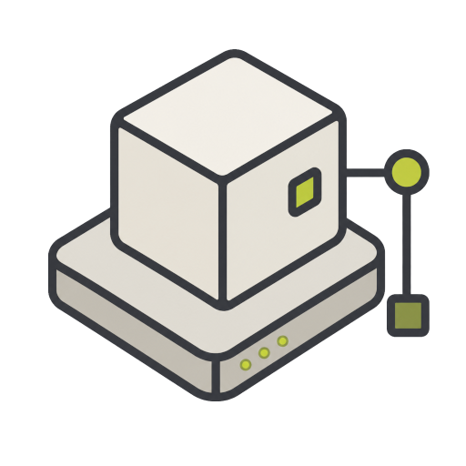

<div align="center">
  
  <h1>platform-infra</h1>
  <p>Proxmox VM lifecycle infrastructure managed with OpenTofu.</p>
</div>

---

`platform-infra` provisions Proxmox VMs with OpenTofu. It owns whether a VM exists and what virtual hardware, network attachment, initial cloud-init access, and handoff outputs it has.

It does not build templates, configure operating systems after boot, deploy applications, or manage Kubernetes tooling.

Public examples use RFC 5737 documentation addresses from `192.0.2.0/24`; replace them with your own private values before planning or applying.

## Start Here

Use the [workflow guide](docs/workflow.md) for private setup, plan/apply, environment switching, destruction, and CI. The [documentation index](docs/README.md) lists all runbooks and references.

- [Requirements](docs/requirements.md): workstation, Proxmox, template, and CI prerequisites.
- [API token setup](docs/proxmox-api-token.md) and [troubleshooting](docs/troubleshooting.md).
- [Manual VM verification](docs/vm-manual-checks.md): post-apply checks before handoff.
- [State](docs/state.md) and [CI](docs/ci.md): isolation and remote-state requirements.
- [Publication checklist](docs/publication-checklist.md) and [license](LICENSE).

### Prerequisites

You need Git, Make, an SSH client, OpenTofu `>= 1.11.7`, an existing Proxmox template, a trusted API endpoint and token, and known target node, bridge, and datastores. The normal workflow also uses `../platform-private` and the setup helpers from [`platform-tools`](https://codeberg.org/rch/platform-tools). The OpenTofu installer needs `curl`, `unzip`, `awk`, and `sha256sum` or `shasum`.

Install the pinned OpenTofu binary and inspect helper targets from the repository root:

```bash
make deps
make help
```

Initialization has three phases: install the repo-pinned OpenTofu binary with `make deps`, create private environment config and per-VM SSH keys, then run native `tofu init`, `validate`, and `plan` from the selected environment root. Use `TOFU_VERSION` or `TOFU_INSTALL_DIR` overrides when needed. See the [initialization summary](docs/workflow.md#infra-initialization-summary) for the command sequence.

Use Make targets from the repository root for setup, formatting, validation, and SSH key helpers. Use native `tofu` commands from the selected `environments/<env>` root for `plan`, `apply`, `destroy`, and output inspection after sourcing the matching private `.tofu.env` file.

## Platform Project

This repository is one part of a multi-repository platform infrastructure project. The included `homelab` and `dev` roots are example environment names; the same workflow can be adapted for production environments with appropriate state, access control, review, backup, monitoring, and change-management controls. The `config-test`, `snapshot-test`, and `migration-test` roots are disposable acceptance fixtures, not production profiles.

| Repository | Purpose |
|---|---|
| [`platform-template-builder`](https://codeberg.org/rch/platform-template-builder) | Builds reusable Proxmox VM templates from cloud images. |
| [`platform-infra`](https://codeberg.org/rch/platform-infra) | Provisions platform infrastructure with OpenTofu. |
| [`platform-config`](https://codeberg.org/rch/platform-config) | Configures operating systems and services with Ansible. |
| [`platform-k8s-bastion`](https://codeberg.org/rch/platform-k8s-bastion) | Contains Kubernetes bastion tooling and operational helpers. |
| [`platform-docs`](https://codeberg.org/rch/platform-docs) | Contains architecture notes, runbooks, diagrams, and operational documentation. |
| [`platform-tools`](https://codeberg.org/rch/platform-tools) | Provides shared optional helper tools used by the platform repositories. |

`platform-tools` is not part of the VM lifecycle chain. It provides optional operator/bootstrap helpers used by the platform repositories.

Typical lifecycle:

```text
platform-template-builder
  -> platform-infra
  -> platform-config
  -> platform-k8s-bastion

platform-docs documents the design and operations across all repositories.
```

`platform-infra` starts after a template exists and stops after VMs are provisioned and exposed through OpenTofu outputs.

## Scope

`platform-infra` owns template cloning, VM names/IDs/tags, CPU/RAM/disks, node/datastore/bridge selection, the guest-agent flag, and OpenTofu handoff outputs. It stops at VM existence, virtual hardware, and initial access.

Template preparation belongs in `platform-template-builder`; post-boot packages, users, guest storage, networking/firewalls, services, certificates, containers, and applications belong in `platform-config` or the appropriate downstream repository. See the [detailed boundaries](docs/requirements.md#repository-boundary).

Cloud-init is intentionally minimal here. This repo may set hostname, initial user, SSH key, IP addressing, and DNS intent. Proxmox cloud-init automatic package upgrades are explicitly disabled; templates provide the initial guest release, and `platform-config` owns subsequent package lifecycle. Do not use cloud-init in this repo for complex OS configuration.

## Proxmox Disk Performance

See [disk defaults and performance guidance](docs/requirements.md#proxmox-disk-performance) for ZFS/raw storage, cache durability, discard versus guest fstrim, and existing-VM change warnings. Guest partitioning, filesystems, LVM, mounts, and `fstab` remain owned by `platform-config`.

## Private Workflow

Keep non-secret environment values in `../platform-private/infra/<env>.tfvars` and matching `<env>.tofu.env` files. Disposable-fixture overlays and evidence live under `../platform-private/infra/<env>/`; their linked lifecycle runbooks define the details.

Secrets and key material stay outside Git:

- Proxmox token: `~/.config/platform-infrastructure/infra/proxmox.token`.
- SSH private keys: `~/.ssh`.
- State files and plan files: ignored and not committed.

Follow the [private setup workflow](docs/workflow.md#one-time-local-private-setup) for exact commands. Production use still requires remote state with locking, reviewed plans, least-privilege credentials, backups, monitoring, and change management.

## Environments

Each directory under `environments/` is an independent OpenTofu root with separate state.

| Root | Purpose |
| --- | --- |
| `homelab`, `dev` | Example platform environments. |
| [`config-test`](docs/proxmox-config-test-environment.md) | One on-demand VM for isolated `platform-config` acceptance. |
| [`snapshot-test`](docs/proxmox-snapshot-test-environment.md) | Two disposable VMs for `platform-proxmox-vm-snapshot` acceptance. |
| [`migration-test`](docs/proxmox-migration-test-environment.md) | Clean Rocky 10.0 and 10.1 baselines for consumer-owned migration tests. |

Each root must use only its matching tfvars and state. Switching VM sets inside one state root can make OpenTofu plan to destroy resources that disappeared from the selected config.

Disposable fixtures exist only for approved campaigns: follow their linked runbooks for stricter saved-plan approval, handoff, and destruction gates. Keep them out of normal service inventories. Destroy their VMs after acceptance while retaining private config and state for repeatability; config-test is normally absent with valid empty state.

To remove managed VMs, use the [destroy workflow](docs/workflow.md#destroy) from the selected environment root. Do not delete OpenTofu-managed VMs manually in Proxmox unless you are intentionally repairing state.

## Secrets Policy

Never commit real environment values, generated state, Proxmox tokens, SSH private keys, or saved plan files.

Commit `.terraform.lock.hcl` after `tofu init` succeeds so provider dependency changes can be reviewed.

## CI/CD

Secret-free validation can run on every pull request with `make verify` for each environment. Proxmox-backed CI plans need private tfvars and a token injected from the CI secret store.

CI apply is not production-grade with ephemeral local state. Add remote state with encryption, access control, and locking before using CI apply.

See the [workflow guide](docs/workflow.md) for steps and [CI reference](docs/ci.md) for details.

## License

MIT License. See [LICENSE](LICENSE).
